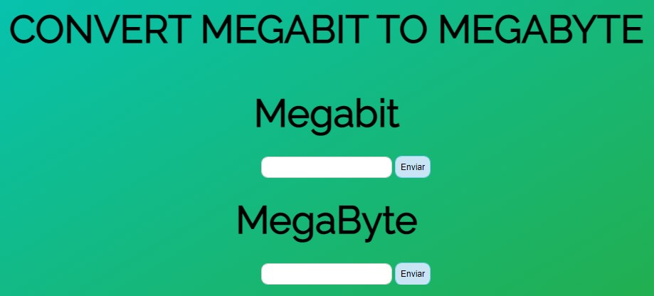

# Conversor Megabit para MegaByte

<h1 align="center">
  
</h1>
 
## Objetivo
Conversor muito simples de um valor em Megabit para outro em MegaByte e vice e versa. Utilizado apenas para exercício de fixação.

## Exemplo do aplicativo
[Clique aqui!](https://paulo-hst.github.io/conversor-megabit-to-megabyte/)

## Tecnologias
- HTML5
- CSS3
- JavaScript

## Status
- [x] Concluído - 26/10/2020
